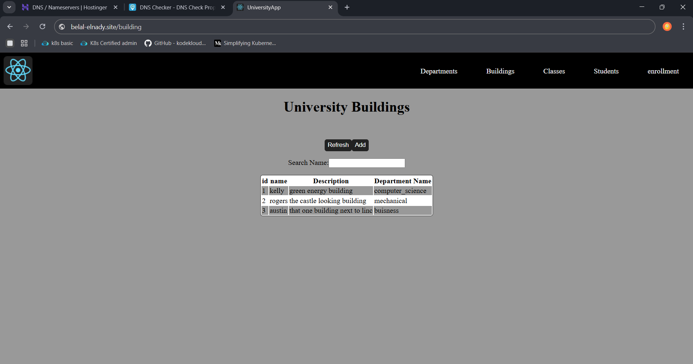
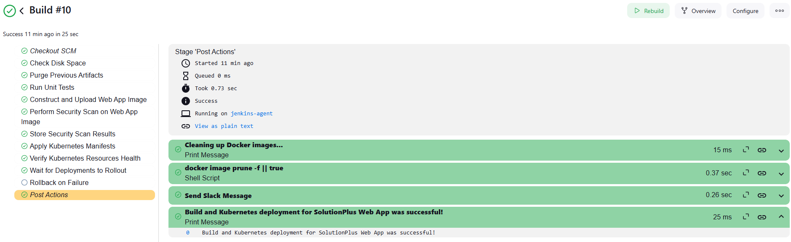
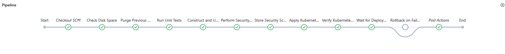
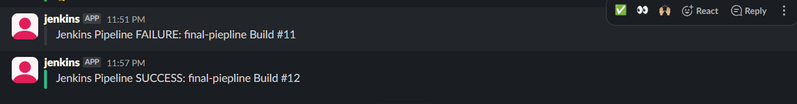
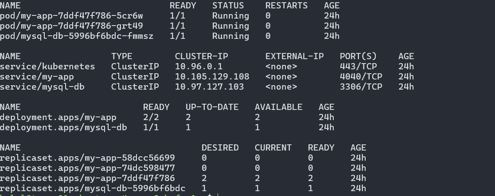
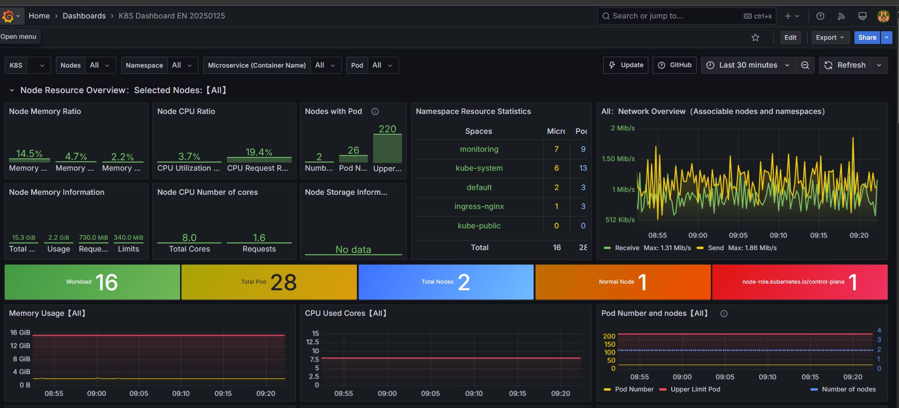
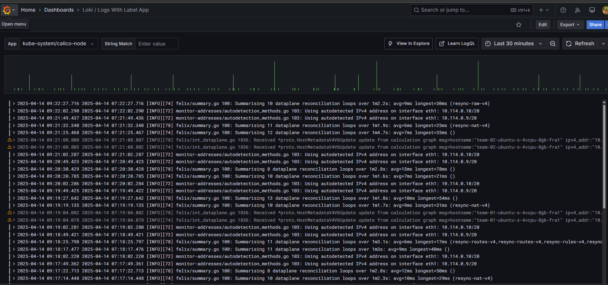
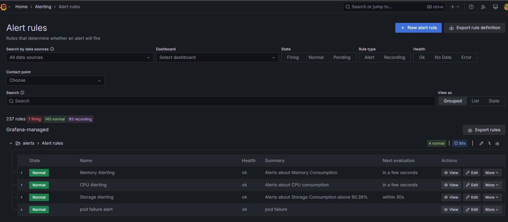
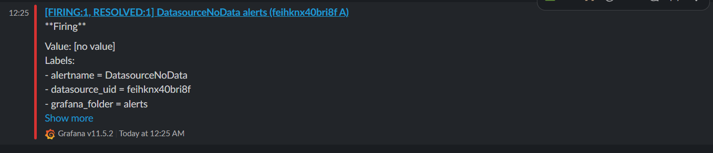

````markdown
# Solution Plus Project

Welcome to the **Solution Plus Project** repository! This project focuses on building an end-to-end DevOps pipeline to automate and scale the deployment of the project on Kubernetes. It incorporates CI/CD, infrastructure automation, monitoring, and security best practices using modern DevOps tools and methodologies.

---

## Project Overview

The **Solution Plus Project** achieves the following:

- **End-to-End Automation:** Automates the entire deployment lifecycle using CI/CD tools.
- **Scalability:** Enables efficient and scalable deployment on Kubernetes clusters.
- **Monitoring and Observability:** Implements robust monitoring and visualization dashboards.
- **Security Best Practices:** Ensures secure deployment pipelines with vulnerability scanning.

### Tools and Technologies Used

The project leverages the following tools:

- **Nginx** - Reverse proxy and load balancing.
- **Docker** - Containerization for application deployment.
- **Kubernetes** - Orchestrates containerized deployments for scalability.
- **Jenkins** - Automates CI/CD pipelines.
- **Ansible** - Infrastructure as Code (IaC) for configuration management.
- **Prometheus & Grafana** - Monitoring and visualization for real-time observability.
- **Trivy** - Security scanning and vulnerability management.
- **PM2** - Process manager for Node.js applications.
- **Loki** - Log aggregation for Kubernetes monitoring.
- **Helm** - Kubernetes package manager for managing application configurations.

---

## Technologies Used in the Codebase

This project is primarily built using the following programming languages and frameworks:

- **TypeScript** - Core programming language for application logic.
- **HTML** - Markup for the user interface.
- **CSS** - Styling for a visually appealing design.
- **Dockerfile** - Container definitions for deployment.
- **Jenkinsfile** - Pipeline definitions.
- **Other** - Additional utilities/tools.

---
````

## Installation and Infastructure Setup With Ansible

Follow these steps to set up the project locally:

1. Clone the repository:

   ```bash
   git clone https://github.com/belalelnady/solution_plus_project.git
   ```

2. Navigate to the project directory:
   ```bash
   cd solution_plus_project
   ```
3. Set up the inventory.ini
   ```bash
   vim Ansible/inventory.ini
   ```
4. Run Ansible Playbook:
   ```bash
   ansible-playbook -i inventory.ini  playbook.yml
   ```

---

## Jenkins

Jenkins Installation Note
Jenkins is installed and configured as part of the deployment pipeline using Ansible.
The Ansible playbook automates the installation process, ensuring consistent and efficient setup across environments.

---

## Docker

To run this project using Docker:

1. Build the Docker image:
   ```bash
   docker build -t solution_plus_project ./application
   ```
2. Run the Docker container:
   ```bash
   docker run -p 3000:3000 solution_plus_project
   ```

---

## Kubernetes Deployment

1. Install dependencies and configure Kubernetes:
   ```bash
   kubectl apply -f ./k8s
   ```
2. Monitor logs using Loki and Prometheus:
   ```bash
   kubectl logs -l app=solution-plus
   ```

---

## Monitoring and Observability

The project integrates the following tools for monitoring and logging:

- **Prometheus**: Collects metrics for monitoring.
- **Grafana**: Visualizes metrics in user-friendly dashboards.
- **Loki**: Aggregates logs from Kubernetes clusters.

---

## Security

The pipeline incorporates **Trivy** for security scanning and vulnerability management, ensuring secure deployments.

---

## Contributing

We welcome contributions! Please follow these steps:

1. Fork the repository.
2. Create a new branch:
   ```bash
   git checkout -b feature/your-feature-name
   ```
3. Commit your changes:
   ```bash
   git commit -m "Add your message here"
   ```
4. Push to the branch:
   ```bash
   git push origin feature/your-feature-name
   ```
5. Open a pull request.

---

### Show Your Support

If you found this project helpful, please give it a and share it with others!

```

### Changes Made:
1. Added your complete project description about the DevOps pipeline.
2. Included tools like PM2, Loki, and Helm in the "Tools and Technologies" section.
3. Updated the Kubernetes deployment section with Helm and Loki details.
4. Added monitoring and security tools in their respective sections.

You can now customize it further and add images (e.g., screenshots or diagrams) to the relevant sections!
```
````

---

## Screenshots

Below are some visual representations of the project. _(Add your images here, e.g., from `/assets` folder)_:

1. **Home Page**
   

2. **Pipleline**
   
   
   

3. **Deployment Pipeline**
   
   

4. **Monitoring Dashboard**
   
   
   
   
   
   
